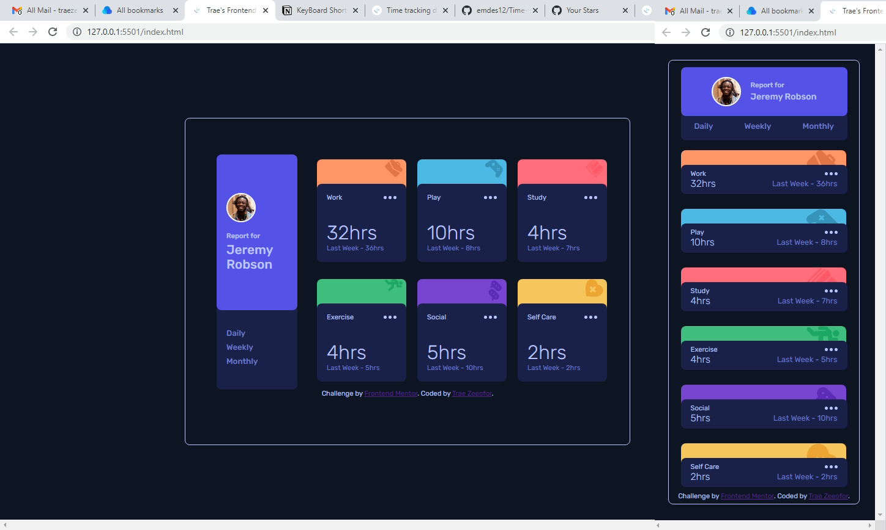

# Frontend Mentor - Time tracking dashboard solution

This is a solution to the [Time tracking dashboard challenge on Frontend Mentor](https://www.frontendmentor.io/challenges/time-tracking-dashboard-UIQ7167Jw). Frontend Mentor challenges help you improve your coding skills by building realistic projects. 

## Table of contents

- [Overview](#overview)
  - [The challenge](#the-challenge)
  - [Screenshot](#screenshot)
  - [Links](#links)
- [My process](#my-process)
  - [Built with](#built-with)
  - [What I learned](#what-i-learned)
  - [Continued development](#continued-development)
  - [Useful resources](#useful-resources)
- [Author](#author)
- [Acknowledgments](#acknowledgments)

## Overview

### The challenge

Users should be able to:

- View the optimal layout for the site depending on their device's screen size
- See hover states for all interactive elements on the page
- Switch between viewing Daily, Weekly, and Monthly stats

### Screenshot

### Links

- Solution URL: [https://github.com/traez/time-tracking-dashboard-main](https://github.com/traez/time-tracking-dashboard-main)
- Live Site URL: [https://traez.github.io/time-tracking-dashboard-main/](https://traez.github.io/time-tracking-dashboard-main/)

## My process

### Built with

- Semantic HTML5 markup
- CSS custom properties
- Flexbox
- CSS Grid
- Mobile-first workflow

### What I learned

First time using objects to hold data while manipulating DOM (will figure out JSON subsequently). Plus i didn't sweat on any solution (both CSS and JavaScript). Insight revealed itself quickly.  

### Continued development

Very proud of myself for this one.  
Me displaying very competent learning thus far, and the potential to continually outdo myself evidently there.  

### Useful resources

Stackoverflow, MDN Web Docs, w3schools, YouTube, Google  

## Author

- Website - [Trae Zeeofor](https://github.com/traez)  
- Frontend Mentor - [@traez](https://www.frontendmentor.io/profile/traez)  
- Twitter - [@trae_z](https://twitter.com/trae_z)

## Acknowledgments

Super Eagles! Thanks for everything. Please give us something to cheer today against Portugal.
